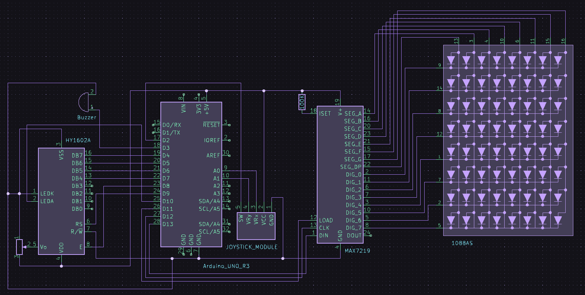

# Introduction

You are in a dark room. Your goal is to get to the other side alive.

## Darkness

You can only see what is immediately next to you. You also have your trustworthy flashlight but be careful, once you see something you shouldn't, it definitely saw you first.

## Creatures

There are creatures lurking inside the room. You don't know how they look like but you probably don't want to. They make noise when you are close, but will only move when you are next to them or your flashlight is on.

## Rooms

Explore different maze-like levels and try to get out in one piece. Avoiding them can only get you so far, use your surroundings to your advantage.

# Controls

Move with your joystick, click the joystick button to enable your flashlight for a few seconds.

In order to complete the level you need to get to the bottom right corner of the map.

# Hardware

## Components

* Arduino UNO development board
* 8x8 LED Matrix + MAX7219 driver
* 16x2 LCD screen + potentiometer for screen contrast
* joystick module
* passive buzzer

# Video Demonstration

:tv: [Watch on YouTube](https://youtu.be/fG2CSYg6Ues)